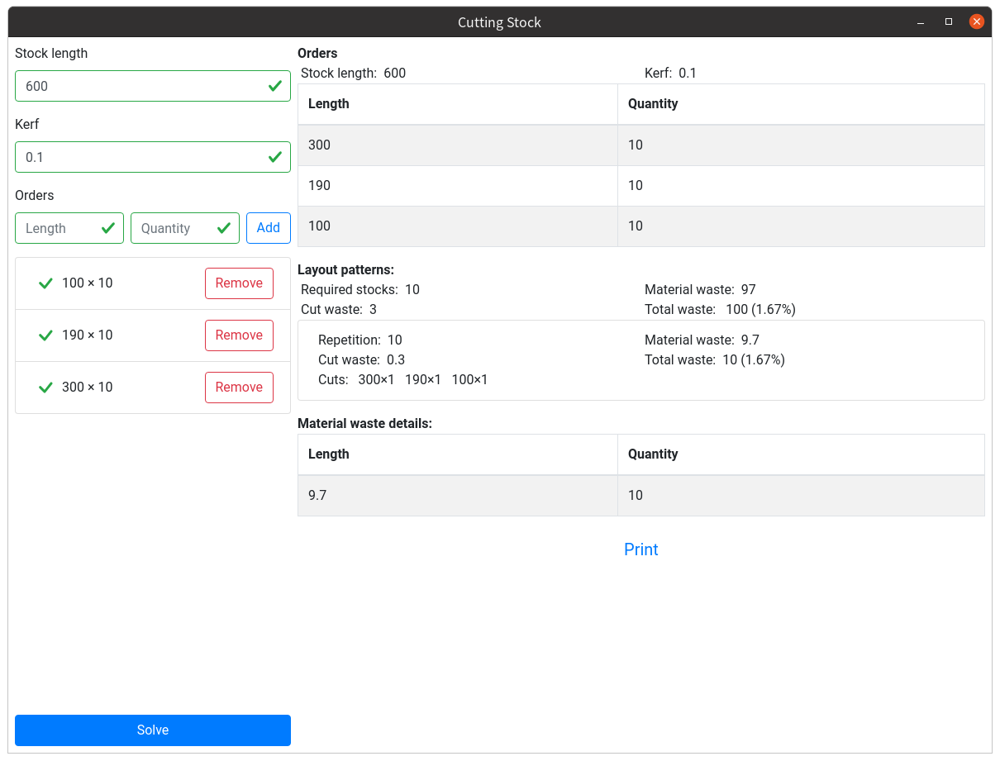

# vue-cutting-stock

[](https://github.com/longyuzhou/vue-cutting-stock/releases)
[](https://github.com/vuejs/vue)
[](https://github.com/vuejs/vuex)
[](https://github.com/electron/electron)
[](https://github.com/longyuzhou/vue-cutting-stock/blob/master/LICENSE)

A application used to solve cutting stock problem.

**I'm using "First Fit Decreasing" algorithm, which will not give you the best solution.**



## Project setup

```
npm install
```

### Compiles and hot-reloads for development

```
npm run serve
```

### Compiles and minifies for production

```
npm run build
```

### Lints and fixes files

```
npm run lint
```

### Run in electron

```
npm run electron
```

### Release desktop version

```
npm run release
```

## Resources

- [Cutting Stock Problem](https://en.wikipedia.org/wiki/Cutting_stock_problem)
- [First Fit Decreasing](https://en.wikipedia.org/wiki/Bin_packing_problem)
